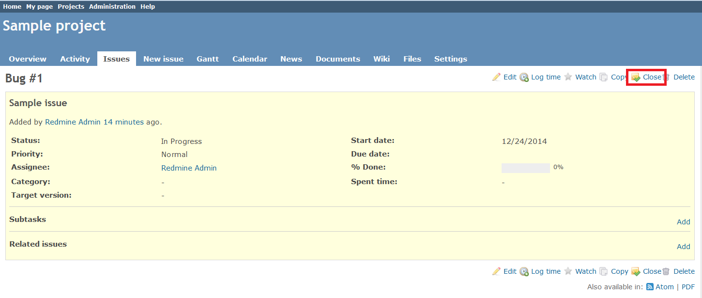
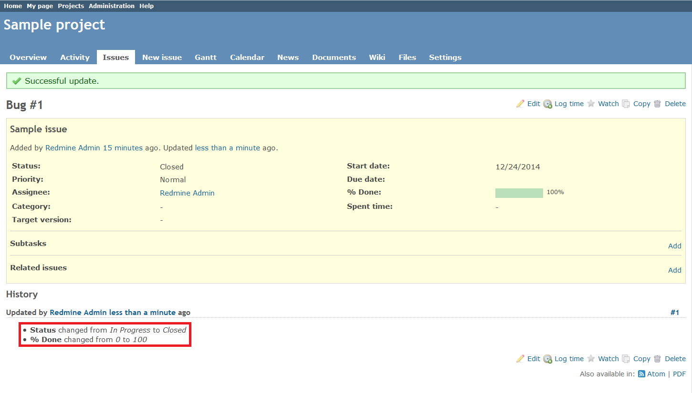

# Redmine Close Issue Button Plugin

This plugin adds the **Close** button to the issue toolbar in Redmine.

## Compatibility

This plugin is compatible with Redmine 0.9.6, 1.0.2, 1.0.5, 1.1.0, 1.2.1, 1.3.1, 2.0.3, 2.1.0, 2.6.0.

## Installation

*These installation instructions are based on Redmine 2.6.0. For instructions for previous versions, see [Redmine wiki](http://www.redmine.org/projects/redmine/wiki/Plugins).*

1. To install the plugin
    * Download the .ZIP archive, extract files and copy the plugin directory into *#{REDMINE_ROOT}/plugins*.
    
    Or

    * Change you current directory to your Redmine root directory:  

            cd {REDMINE_ROOT}
 
      Copy the plugin from GitHub using the following command:

            git clone https://github.com/Undev/redmine_close_button.git plugins/redmine_close_button

2. Update the Gemfile.lock file by running the following commands:  

         rm Gemfile.lock  
         bundle install

3. Restart Redmine.

Now you should be able to see the plugin in **Administration > Plugins**.
 
## Usage

This plugin adds the **Close** button to the issue toolbar in Redmine. The **Close** button is displayed if the following conditions are met:

* A user is allowed to close the issue.
* The issue is neither closed nor rejected.

To close the issue, click the **Close** button on the issue toolbar.

This will change the issue status to **Closed** and its progress to **100%**.

## License

Copyright (c) 2014 Undev

Licensed under the Apache License, Version 2.0 (the "License");
you may not use this file except in compliance with the License.
You may obtain a copy of the License at

http://www.apache.org/licenses/LICENSE-2.0

Unless required by applicable law or agreed to in writing, software
distributed under the License is distributed on an "AS IS" BASIS,
WITHOUT WARRANTIES OR CONDITIONS OF ANY KIND, either express or implied.
See the License for the specific language governing permissions and
limitations under the License.
